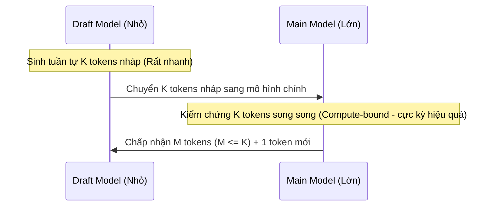

# Tóm Tắt & Đi Sâu: Model Compression & Acceleration (Nén & Tăng Tốc Mô Hình NLP/LLM)

Tài liệu này tổng hợp toàn bộ kiến thức cốt lõi từ slide bài học `lecture_efficiency.pdf` (Episode 8) kết hợp với các kiến thức chuyên sâu bên ngoài về tối ưu hóa hiệu năng, nén mô hình và tăng tốc độ suy luận (inference) cho các mô hình ngôn ngữ lớn (LLMs).

---

## 1. Tổng Quan & Động Lực (Why Should You Care?)

### 1.1. Các Yêu Cầu Hệ Thống (System Requirements)
Khi triển khai một mô hình trí tuệ nhân tạo (đặc biệt là các LLM) vào môi trường production, chúng ta phải cân nhắc và tối ưu hóa đồng thời ba yếu tố kỹ thuật cốt lõi:
*   **Model Size** (Dung lượng mô hình): Đo bằng Megabytes hoặc Gigabytes. Kích thước mô hình quyết định lượng bộ nhớ (DRAM/VRAM) tối thiểu cần để nạp mô hình lên thiết bị.
*   **Throughput** (Băng thông/Năng suất): Số lượng mẫu xử lý được trong một đơn vị thời gian (đo bằng `samples/second` hoặc `tokens/second`). Throughput càng cao thì chi phí vận hành hệ thống trên mỗi người dùng càng thấp.
*   **Latency** (Độ trễ): Thời gian phản hồi cho từng yêu cầu đơn lẻ (đo bằng `ms`), thường được thống kê dưới dạng các phân vị (percentiles) như $p50$, $p90$, $p99$ (`ms@percentile`) nhằm đảm bảo trải nghiệm tương tác thời gian thực không bị gián đoạn.

### 1.2. Triển Khai trên Cloud Server vs. Thiết Bị Biên (Mobile/Edge Deployment)
Tùy thuộc vào yêu cầu của ứng dụng, mô hình có thể được phân phối theo hai hướng chính:

| Tiêu chí so sánh | Cloud Inference Server | Mobile/Edge Deployment |
| :--- | :--- | :--- |
| **Phần cứng sử dụng** | CPU hiệu năng cao, GPU chuyên dụng (NVIDIA A100, H100, H200, v.v.), FPGA hoặc TPU. | Mobile CPU, Mobile GPU và các bộ tăng tốc AI chuyên biệt như NPU (Apple Neural Engine, Google Tensor TPU). |
| **Ưu điểm** | - Dễ dàng triển khai, cập nhật và bảo trì mô hình. - Người phát triển kiểm soát hoàn toàn mã nguồn suy luận. - Thiết bị client (điện thoại, máy tính người dùng) không tốn pin và tài nguyên tính toán. | - Bảo mật thông tin tuyệt đối (chạy offline trên thiết bị). - Không tốn chi phí vận hành và duy trì server. - Không bị gián đoạn bởi chất lượng kết nối mạng. |
| **Thách thức cốt lõi** | Tối ưu hóa **Throughput** tối đa trên mỗi đơn vị chi phí phần cứng (Maximize throughput per dollar). | Hạn chế nghiêm ngặt về dung lượng bộ nhớ (DRAM), điện năng tiêu thụ (**Power Consumption**) và nhiệt lượng tỏa ra. |
| **Các công cụ/Frameworks phổ biến** | vLLM, TensorRT-LLM, Triton Inference Server, TGI (Text Generation Inference). | CoreML (iOS), NNAPI (Android), ExecuTorch (Meta), MLX (Apple Silicon), TensorFlow.js. |

---

## 2. Các Nút Thắt Hiệu Năng Trong Suy Luận GPU (Bottlenecks in GPU Inference)

Để tối ưu hóa tốc độ thực thi của GPU, ta cần hiểu bản chất vật lý của bộ xử lý đồ họa thông qua hai chỉ số quan trọng: **Băng thông bộ nhớ (Memory Bandwidth)** và **Năng lực tính toán (TFLOPS)**.

### 2.1. Phân Tích Độ Phức Tạp Toán Học (Math Behind GPU Utilization)
Khi xử lý đồng thời $K$ tokens trong một phép nhân ma trận-vector (matrix-vector product) để sinh từ:
*   **Memory Transfer Load** (Tải truyền nhận dữ liệu bộ nhớ): Có độ phức tạp là $O(N^2 + K \times N)$ cho mỗi phép nhân.
*   **Compute Load** (Tải tính toán): Có độ phức tạp là $O(K \times N^2)$.
*(Trong đó $N$ là kích thước chiều ẩn - hidden dimension của mô hình)*

> [!IMPORTANT]
> **Quy luật vật lý của GPU:**
> Việc nạp dữ liệu (hàng tỷ tham số của mô hình) từ bộ nhớ ngoài (VRAM/HBM) vào các thanh ghi/SRAM của các nhân xử lý (CUDA cores/Tensor cores) là cực kỳ **CHẬM** (bị giới hạn bởi tốc độ đọc/ghi bộ nhớ).
> Ngược lại, một khi dữ liệu đã nằm trong các nhân xử lý, GPU thực hiện các phép toán số học cực kỳ **NHANH** nhờ hàng ngàn nhân tính toán song song.

### 2.2. Hai Trạng Thái Giới Hạn: Memory-bound vs. Compute-bound

#### A. Trạng Thái Memory-bound (Giới hạn băng thông bộ nhớ)
*   **Kịch bản xảy ra:** Khi sinh từng token một tuần tự ($K \approx 1$) cho một người dùng đơn lẻ (Autoregressive Generation Phase).
*   **Đặc điểm tính toán:**
    - Tải truyền dữ liệu: $O(N^2)$ (GPU bắt buộc phải nạp toàn bộ trọng số của tầng đó từ VRAM vào nhân xử lý chỉ để tính toán cho duy nhất 1 token mới).
    - Tải tính toán: $O(N^2)$.
*   **Kết quả:** Hệ số tận dụng năng lực tính toán của GPU (GPU utilization) cực kỳ thấp. GPU dành hầu hết thời gian để "chờ" nạp trọng số từ VRAM. Lúc này, **độ trễ (Latency) gần như không đổi cho dù $K$ có tăng nhẹ**, bởi vì thời gian nạp trọng số mô hình chiếm tuyệt đối.

#### B. Trạng Thái Compute-bound (Giới hạn năng lực tính toán)
*   **Kịch bản xảy ra:** Khi tiền xử lý prompt (Prefill Phase) cho chuỗi dài, hoặc khi chạy suy luận song song với kích thước lô lớn (Large Batch Size) ($K \gg 1$ hoặc $K > N$).
*   **Đặc điểm tính toán:**
    - Tải truyền dữ liệu: $O(K \times N)$ (Trọng số mô hình được nạp một lần duy nhất vào cache và được tái sử dụng để nhân với toàn bộ $K$ tokens).
    - Tải tính toán: $O(K \times N^2)$.
*   **Kết quả:** GPU chạy hết công suất của các nhân Tensor Core. Lúc này, tốc độ bị giới hạn bởi khả năng tính toán số lượng phép tính dấu phẩy động trên giây (TFLOPS) của GPU. Độ trễ (Latency) tăng tuyến tính theo kích thước $K$.

---

## 3. Các Cơ Chế Tối Ưu Hóa Suy Luận (Inference Server Optimization)

### 3.1. Batching & Khung Triển Khai (Serving Frameworks)
*   **Batching:** Gom nhiều yêu cầu độc lập của người dùng thành một lô (batch) để xử lý song song. Việc này chuyển đổi trạng thái của GPU từ *memory-bound* sang *compute-bound*, nâng cao **Throughput** tổng thể của hệ thống. Tuy nhiên, nó đi kèm cái giá là làm tăng **Latency** của một số yêu cầu đơn lẻ (do phải đợi gom đủ lô hoặc đợi các câu dài hơn cùng hoàn thành).
*   **Phân tích các Serving Frameworks phổ biến:**
    - **vLLM:** Thiết kế tối ưu hóa triệt để hiệu năng thông qua quản lý bộ nhớ thông minh (PagedAttention). Rất phù hợp khi ưu tiên Throughput hệ thống cực đại, tiết kiệm tối đa chi phí phần cứng (*Efficiency $\gg$ Developer Time*).
    - **Triton Inference Server (NVIDIA):** Hỗ trợ đa mô hình, đa backend. Đòi hỏi thời gian cấu hình và tối ưu hóa trung bình từ phía lập trình viên (*Efficiency $\approx$ Developer Time*).
    - **Custom model-dependent code:** Viết mã nguồn tối ưu hóa riêng biệt cho một mô hình cụ thể. Đạt hiệu năng tối đa nhưng cực kỳ tốn thời gian phát triển và khó bảo trì (*Efficiency $\ggg$ Developer Time*).

### 3.2. KV-Cache & PagedAttention
#### A. KV-Cache là gì và tại sao lại quan trọng?
Trong kiến trúc Transformer, cơ chế Attention yêu cầu tính toán sự tương tác giữa token hiện tại và tất cả các token trước đó trong ngữ cảnh. Để tránh việc tính toán lặp lại các vector Key ($K$) và Value ($V$) của các token cũ ở mỗi bước sinh từ (decoding step), ta lưu trữ chúng vào một vùng nhớ đệm gọi là **KV-Cache**.
*   **Vấn đề bộ nhớ động:** Trong khi trọng số tĩnh của mô hình là cố định (ví dụ: Llama-7B dạng FP16 chiếm khoảng 14GB VRAM), thì dung lượng **KV-Cache** lại tăng tuyến tính theo số lượng người dùng đồng thời (Batch Size) và chiều dài ngữ cảnh (Context Length). Nó nhanh chóng chiếm hơn 30% bộ nhớ GPU và trở thành nguyên nhân chính gây ra lỗi tràn bộ nhớ (Out-Of-Memory - OOM).

#### B. PagedAttention (Giải pháp đột phá của vLLM)
*   **Hạn chế của cơ chế cũ:** Hệ thống truyền thống cấp phát bộ nhớ KV-Cache liên tục (contiguous memory) cho mỗi request dựa trên chiều dài tối đa của câu (Max Sequence Length). Do không biết trước câu trả lời dài bao nhiêu, điều này gây ra:
    1.  *Internal Fragmentation (Phân mảnh nội bộ):* Dành sẵn bộ nhớ cho 2048 tokens nhưng câu trả lời thực tế chỉ dài 100 tokens. Khoảng trống còn lại bị bỏ phí.
    2.  *External Fragmentation (Phân mảnh ngoài):* Các vùng nhớ trống nằm rải rác không thể gộp lại để phục vụ request mới.
*   **Nguyên lý PagedAttention:** Lấy cảm hứng từ cơ chế Trang bộ nhớ (Virtual Memory Paging) trong hệ điều hành. KV-Cache được chia nhỏ thành các **physical KV blocks** cố định chứa một số lượng token nhất định (ví dụ: 16 tokens). Một bảng trang logic (Logical-to-Physical Block Table) sẽ quản lý và ánh xạ các block này.
*   **Lợi ích:**
    - Triệt tiêu hoàn toàn sự lãng phí bộ nhớ (giảm tỷ lệ phân mảnh xuống gần 0%).
    - Cho phép chia sẻ vùng nhớ KV-cache vật lý giữa các request khác nhau (rất hữu ích khi chạy Parallel Sampling hoặc Beam Search).
    - Tăng số lượng request phục vụ song song lên gấp nhiều lần trên cùng một phần cứng (phục vụ ~100.000 tokens với PagedAttention so với chỉ vài nghìn tokens trước đây).

### 3.3. Tự Giải Mã Suy Đoán (Speculative Decoding)
Kỹ thuật này giải quyết bài toán sinh từ chậm do bị nghẽn băng thông bộ nhớ (memory-bound) bằng cách sử dụng hai mô hình phối hợp:
1.  **Draft Model** (Mô hình nháp): Kích thước nhỏ (ví dụ: Llama-7B), độ chính xác thấp hơn nhưng tốc độ sinh từ cực kỳ nhanh.
2.  **Main Model** (Mô hình chính): Kích thước lớn (ví dụ: Llama-70B), độ chính xác cao nhưng tốc độ sinh từ chậm.

*   **Cơ chế hoạt động:**
    - **Bước 1:** Draft Model chạy tự hồi quy để sinh ra trước một chuỗi gồm $K$ tokens nháp.
    - **Bước 2:** Main Model nhận chuỗi $K$ tokens này làm đầu vào và chạy suy luận **song song** trong một bước duy nhất (chạy ở trạng thái *compute-bound* giúp tối ưu hóa GPU hiệu quả hơn nhiều so với chạy tuần tự).
    - **Bước 3:** So sánh phân phối xác suất đầu ra của hai mô hình tại từng vị trí. Sử dụng thuật toán bác bỏ (Rejection Sampling) để quyết định chấp nhận $M$ tokens đầu tiên ($M \le K$). Chúng ta luôn nhận được ít nhất $M+1$ tokens chính xác sau mỗi chu kỳ kiểm chứng của mô hình lớn.
*   **Chế độ Greedy Sampling:** Chấp nhận toàn bộ chuỗi nháp cho đến khi xuất hiện token đầu tiên không khớp chính xác giữa hai mô hình.

---

## 4. Các Phương Pháp Nén Mô Hình (Model Compression)

Để giảm thiểu Model Size và tăng tốc độ xử lý, có ba hướng tiếp cận cốt lõi: Chưng cất tri thức (Distillation), Cắt tỉa trọng số (Pruning) và Lượng tử hóa (Quantization).

### 4.1. Chưng Cất Tri Thức (Compression by Distillation)
*   **Ý tưởng:** Truyền tải tri thức tích lũy từ một mô hình lớn, cồng kềnh đã huấn luyện xong (gọi là **Teacher**) sang một mô hình nhỏ gọn, tối ưu hơn (gọi là **Student**).
*   **Hàm mất mát huấn luyện (Training Objective):**
    - Sử dụng độ đo **Kullback-Leibler (KL) Divergence** để ép phân phối xác suất đầu ra (logits) của Student tiệm cận phân phối của Teacher.
    - Đối với các bài toán hồi quy (regression) hoặc ép các trạng thái ẩn (intermediate states), ta có thể sử dụng hàm sai số bình phương trung bình (MSE/MAE).
*   **Lựa chọn kiến trúc cho Student:**
    - *Naive (Ngây thơ):* Cắt giảm số lượng tầng (layers) hoặc chiều ẩn (hidden dimensions) một cách thủ công rồi huấn luyện lại từ đầu (ví dụ: **DistilBERT** giữ lại cấu trúc của BERT nhưng giảm một nửa số layer, chạy nhanh hơn 1.5 lần và giữ được 97% độ chính xác).
    - *Sparse/Pruning-based:* Cắt tỉa các thành phần dư thừa của Teacher, sau đó sử dụng các phần trọng số còn lại làm giá trị khởi tạo trực tiếp cho Student trước khi tiến hành chưng cất.
*   **Quy trình Minitron (NVIDIA - arxiv.org/abs/2407.14679):**
    - Thay vì huấn luyện các mô hình nhỏ độc lập từ đầu, Minitron huấn luyện mô hình lớn nhất trước, sau đó tiến hành **cắt tỉa (pruning) và chưng cất (distillation) lặp đi lặp lại** (iteratively).
    - Đánh giá tầm quan trọng của các attention heads/neurons dựa trên biên độ kích hoạt (activation scales) và tầm quan trọng của các tầng (layers) dựa trên chỉ số Perplexity (PPL).
    - Kết quả thực nghiệm cho thấy việc chưng cất sau khi cắt tỉa giúp huấn luyện các mô hình nhỏ (như Minitron 8B, 4B) với **chi phí tính toán rẻ hơn tới 40 lần** so với huấn luyện truyền thống từ đầu, trong khi giữ được chất lượng vượt trội.

### 4.2. Cắt Tỉa Trọng Số (Compression by Sparsification & Pruning)
*   **Đặt vấn đề:** Liệu chúng ta có thực sự cần toàn bộ ma trận trọng số kích thước $D \times D$? Phần lớn các liên kết trong mạng nơ-ron sâu là dư thừa hoặc có trọng số rất gần 0.
*   **Phân loại độ thưa (Sparsity):**
    1.  **Unstructured Sparsity** (Thưa vô cấu trúc): Loại bỏ các trọng số đơn lẻ bất kỳ có giá trị nhỏ nhất (ví dụ: **Magnitude Pruning** loại bỏ 5% trọng số nhỏ nhất sau mỗi 1000 bước huấn luyện). Phương pháp này giúp nén dung lượng file lưu trữ rất tốt, nhưng **không tăng tốc độ suy luận trên GPU thông thường** vì phần cứng GPU được thiết kế tối ưu cho các phép tính ma trận dày đặc (dense matrix multiplication).
    2.  **Structured Sparsity** (Thưa có cấu trúc): Loại bỏ hoàn toàn các cấu trúc nguyên khối như neuron, attention head hoặc cả tầng (layer). Giúp giảm trực tiếp kích thước ma trận tính toán, từ đó tăng tốc độ suy luận nguyên bản trên mọi thiết bị phần cứng.
    3.  **Low-level/Hardware-friendly Structured Sparsity:** Ví dụ như cấu trúc thưa 2:4 (2-out-of-4 sparsity) trên các dòng GPU NVIDIA Ampere (A100) trở về sau. Cứ mỗi nhóm 4 trọng số liên tiếp thì bắt buộc có đúng 2 trọng số bằng 0. GPU hỗ trợ tăng tốc phần cứng trực tiếp để tính toán ma trận thưa dạng này nhanh gấp 2 lần.
*   **Ước lượng độ quan trọng (Importance Estimation):**
    - Cấp độ Head/Neuron: Đo lường bằng biên độ kích hoạt trung bình (activation scales).
    - Cấp độ Layer/Block: Đo lường bằng độ thay đổi của Perplexity (PPL) khi loại bỏ layer đó khỏi mạng.
    - Học tham số độ quan trọng ($L_0$ Regularization): Thêm các cổng học được (learnable gates) dạng $w_i = w_i \times \sigma(a_i + N(0, 1))$ để mạng tự tối ưu hóa việc giữ/bỏ liên kết thông qua lan truyền ngược.

### 4.3. Lượng Tử Hóa (Compression by Quantization)
Lượng tử hóa là quá trình chuyển đổi các tham số (weights) và giá trị kích hoạt (activations) từ định dạng số thực dấu phẩy động độ chính xác cao (FP32, FP16, BF16) sang định dạng số nguyên hoặc số thực có số bit thấp hơn (INT8, INT4, FP8, FP4).

#### A. Lượng tử hóa tuyến tính (Linear Quantization)
Ánh xạ tuyến tính các giá trị số thực $w$ vào một dải số nguyên rời rạc có số bit thấp:
*   **Scale (Tỷ lệ):** $s = \frac{\max(w) - \min(w)}{2^b - 1}$ (với $b$ là số bit lượng tử hóa).
*   **Zero-point (Điểm không):** $z = \text{round}\left(\frac{-\min(w)}{s}\right)$
*   **Mã hóa (Encode):** $c_i = \text{clip}\left(\text{round}\left(\frac{w_i}{s}\right) + z, 0, 2^b - 1\right)$
*   **Giải mã (Decode):** $w_i \approx s \times (c_i - z)$

#### B. Hiện tượng Outlier Features & Giải pháp LLM.int8() (arxiv.org/abs/2208.07339)
*   **Hiện tượng:** Khi các LLM đạt quy mô tham số lớn ($> 6.7\text{B}$), một số chiều ẩn (hidden state dimensions) sẽ xuất hiện các giá trị kích hoạt cực kỳ lớn (outliers). Chúng xuất hiện một cách có hệ thống và chứa đựng hầu hết thông tin quan trọng của mô hình.
*   **Giải pháp LLM.int8():** Nếu lượng tử hóa toàn bộ ma trận sang INT8, các outlier này sẽ phá hủy độ chính xác của mô hình. Do đó, thuật toán sẽ tách biệt:
    - Các cột chứa outlier ($<1\%$ tổng số tính toán) được giữ nguyên ở dạng FP16 để thực hiện phép nhân độ chính xác cao.
    - $99\%$ phần còn lại không chứa outlier được lượng tử hóa sang INT8 để nhân ma trận tốc độ cao.
    - Cộng kết quả của hai phần lại để thu được đầu ra cuối cùng, giúp giữ nguyên độ chính xác của mô hình FP16 gốc.

#### C. Lượng tử hóa phi tuyến (Nonlinear Quantization) & NF4 (Normal Float 4)
*   **Ý tưởng:** Thay vì chia đều các khoảng lượng tử hóa tuyến tính, ta sử dụng thuật toán phân cụm (ví dụ k-means 1D) để tìm các trọng tâm (centroids) tối ưu đại diện cho phân phối thực tế của trọng số. Trọng số sẽ được lưu trữ dưới dạng chỉ mục (index) của centroid gần nhất.
*   **NF4 (Normal Float 4):** Là một dạng lượng tử hóa phi tuyến được thiết kế riêng cho các trọng số có phân phối chuẩn (Zero-mean Normal Distribution). NF4 chia đường cong phân phối chuẩn thành 16 khoảng có xác suất xuất hiện tương đương nhau (7 quantile âm, 1 điểm 0 tuyệt đối và 8 quantile dương). Đây là định dạng lượng tử hóa mặc định trong kỹ thuật **QLoRA** giúp tinh chỉnh các mô hình lớn cực kỳ hiệu quả.

#### D. Hiệu quả suy luận lượng tử hóa trên GPU (Quantized GPU Inference)
Triển khai lượng tử hóa trên GPU mang lại hiệu quả tăng tốc khác nhau tùy thuộc vào đối tượng được lượng tử hóa:

| Phương pháp | Đối tượng lượng tử hóa | Tác động tới Memory-bound ($K \approx 1$) | Tác động tới Compute-bound ($K \gg 1$) | Cơ chế hoạt động của phần cứng |
| :--- | :--- | :--- | :--- | :--- |
| **Weight-Only Quantization** (W4A16, W8A16) | Chỉ lượng tử hóa Trọng số (Weights) sang 4/8-bit. Giá trị kích hoạt (Activations) giữ nguyên ở FP16. | **Tăng tốc rõ rệt** (Tốc độ tăng gấp $C$ lần vì dung lượng nạp trọng số từ VRAM giảm đi $C$ lần). | **Không tăng tốc** (Do GPU vẫn phải giải nén trọng số ngược về FP16 trước khi thực hiện phép nhân ma trận). | Yêu cầu các kernel tối ưu hóa giải nén cực nhanh trên GPU (như Marlin trong vLLM hoặc các bộ kernel của llama.cpp). |
| **Weight + Activation Quantization** (W8A8, W4A4, FP8) | Lượng tử hóa cả Trọng số và Kích hoạt sang số bit thấp. Phép nhân ma trận diễn ra trực tiếp trên định dạng bit thấp. | **Tăng tốc mạnh mẽ** nhờ giảm dung lượng dữ liệu truyền nhận từ VRAM. | **Tăng tốc vượt trội** nhờ tận dụng tốc độ tính toán số nguyên/FP8 cực nhanh của Tensor Cores phần cứng. | Đòi hỏi phần cứng hỗ trợ tính toán số bit thấp nguyên bản (ví dụ: INT4 trên Ada GPUs, FP8 trên Hopper GPUs, NVFP4/MXFP4 trên Blackwell). |

#### E. Post-Training Quantization (PTQ) vs. Quantization-Aware Training (QAT)
*   **PTQ (Lượng tử hóa sau huấn luyện):** Lượng tử hóa trực tiếp mô hình đã hoàn thành huấn luyện mà không cần train lại. Để giảm thiểu sai số, người ta sử dụng một tập dữ liệu nhỏ (calibration dataset) để tìm các tham số lượng tử hóa tối ưu:
    - **GPTQ (Frantar et al., 2022):** Giải bài toán tối ưu hóa quadratic cục bộ theo từng layer: $\text{argmin}_{\widehat{W}_l} \|W_l X_l - \widehat{W}_l X_l\|_2^2$. Thuật toán lượng tử hóa ma trận trọng số theo từng cột và liên tục cập nhật các cột chưa lượng tử hóa còn lại bằng thông tin từ ma trận nghịch đảo Hessian (Cholesky Decomposition) để triệt tiêu sai số tích lũy.
    - Các kỹ thuật SOTA PTQ khác: AWQ, QuIP#, AQLM, SpinQuant, QuaRot.
    - **LLM Compressor:** Thư viện mã nguồn mở sản xuất (production-ready) của vLLM hỗ trợ các thuật toán lượng tử hóa hiện đại.
*   **QAT (Huấn luyện nhận biết lượng tử hóa):** Mô phỏng lỗi lượng tử hóa trực tiếp trong quá trình huấn luyện/tinh chỉnh mô hình bằng cách chèn các nút *Fake Quantization* ở chiều forward. Trọng số thực vẫn được cập nhật ở chiều backward nhờ kỹ thuật **Straight-Through Estimator (STE)** (vì đạo hàm của hàm làm tròn `round` bằng 0 ở hầu hết mọi nơi). Phương pháp này giúp mô hình thích nghi tốt nhất với môi trường số bit thấp, hạn chế tối đa suy giảm độ chính xác nhưng tốn rất nhiều tài nguyên tính toán để huấn luyện lại.
    - Các công trình SOTA QAT gần đây: QuEST (ICML 2025), Quartet.

---

## 5. Tổng Kết Kiến Thức Thực Tiễn (Key Takeaways)

1.  **Mọi hệ thống LLM đều tồn tại nút thắt (Bottleneck):** Lập trình viên cần xác định rõ hệ thống đang bị giới hạn bởi **Băng thông bộ nhớ (Memory-bound)** hay **Năng lực tính toán (Compute-bound)** để lựa chọn phương pháp tối ưu hóa phù hợp (ví dụ: dùng Weight-only Quantization cho chat đơn luồng, dùng Batching hoặc Weight+Activation Quantization cho hệ thống phục vụ nhiều người dùng).
2.  **Lượng tử hóa 3-4 bits là điểm Pareto-Optimal:** Đảm bảo mô hình thu nhỏ tối đa từ 3 đến 4 lần mà hầu như không làm giảm chất lượng thế tạo văn bản. Ở mức 2-bit, sự suy giảm độ chính xác thường rõ rệt hơn và đòi hỏi các thuật toán tối ưu hóa phức tạp hơn nhiều (như AQLM).
3.  **Tối ưu hóa là sự kết hợp chặt chẽ giữa Phần cứng & Phần mềm:** Để khai thác tối đa tốc độ của mô hình nén, ta cần sự hỗ trợ của các kiến trúc chip hiện đại (như Ada, Hopper, Blackwell của NVIDIA) kết hợp với các thư viện phần mềm tối ưu hóa sâu (như vLLM, TensorRT-LLM, llama.cpp).
