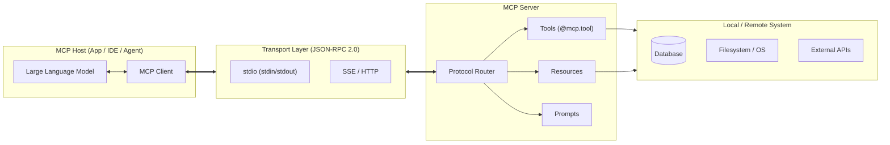
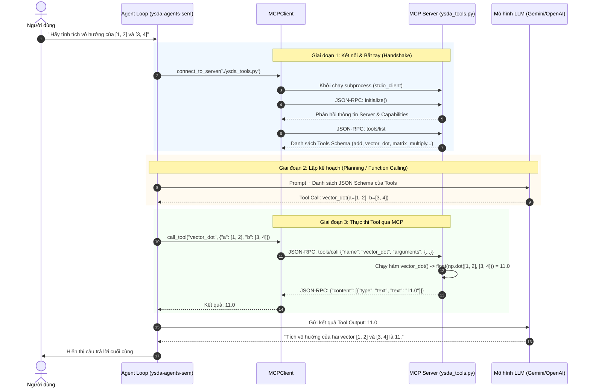

# Cẩm Nang Toàn Diện Về Model Context Protocol (MCP)

> **Mục tiêu tài liệu:** Tổng hợp kiến thức chuẩn quốc tế về giao thức **Model Context Protocol (MCP)** do Anthropic khởi xướng, kết hợp phân tích chuyên sâu từng dòng mã nguồn trong bài thực hành `ysda-agents-sem` (`ysda_tools.py` và `MCPClient` trong Jupyter Notebook) để làm sáng tỏ cách thức hoạt động thực tế của MCP Server & Client.

---

## MỤC LỤC
1. [Tổng Quan: MCP Là Gì & Tại Sao Ra Đời?](#1-tổng-quan-mcp-là-gì--tại-sao-ra-đời)
2. [Kiến Trúc Cốt Lõi Của MCP (Architecture)](#2-kiến-trúc-cốt-lõi-của-mcp-architecture)
3. [Ba Khái Niệm Nguyên Tử (Core Primitives): Tools, Resources, Prompts](#3-ba-khái-niệm-nguyên-tử-core-primitives)
4. [Cơ Chế Giao Tiếp & Giao Thức Truyền Dẫn (Transports & JSON-RPC)](#4-cơ-chế-giao-tiếp--giao-thức-truyền-dẫn)
5. [Mổ Xẻ Mã Nguồn MCP Trong Seminar YSDA](#5-mổ-xẻ-mã-nguồn-mcp-trong-seminar-ysda)
   - 5.1. Phân tích MCP Server (`ysda_tools.py`)
   - 5.2. Phân tích MCP Client (`MCPClient` trong `ysda-agents-sem.ipynb`)
   - 5.3. Vòng đời luồng kết nối và thực thi (Execution Lifecycle)
6. [So Sánh MCP Với Các Tiếp Cận Truyền Thống](#6-so-sánh-mcp-với-các-tiếp-cận-truyền-thống)
7. [Hệ Sinh Thái & Ứng Dụng Thực Tiễn](#7-hệ-sinh-thái--ứng-dụng-thực-tiễn)
8. [Cẩm Nang Debugging & Những Cạm Bẫy (Gotchas) Cần Tránh](#8-cẩm-nang-debugging--những-cạm-bẫy-gotchas-cần-tránh)

---

## 1. TỔNG QUAN: MCP LÀ GÌ & TẠI SAO RA ĐỜI?

### 1.1. Bối cảnh ra đời
Trước khi có MCP, mỗi nền tảng AI (OpenAI, Anthropic, LangChain, LlamaIndex, AutoGPT...) đều xây dựng cơ chế gọi công cụ (Function Calling / Tools) và tích hợp dữ liệu theo các chuẩn riêng biệt:
- Viết 1 công cụ cho OpenAI API -> Phải viết lại nếu muốn dùng cho Anthropic Claude hoặc LangChain.
- Nếu bạn có $N$ mô hình AI / Framework và $M$ nguồn dữ liệu / công cụ (GitHub, Slack, PostgreSQL, Local Files...), số lượng tích hợp cần viết và bảo trì là $N \times M$ tích hợp (bài toán bùng nổ tổ hợp).

```
[Trước MCP: Phức tạp N x M]
Claude Desktop ───┬─── GitHub API
OpenAI Agent   ───┼─── PostgreSQL
Cursor IDE     ───┼─── Slack API
Local Script   ───┴─── Local Files
(Mỗi bên tự viết adapter, format schema riêng lẻ)
```

### 1.2. Model Context Protocol (MCP) là gì?
Vào tháng 11/2024, **Anthropic** chính thức công bố **Model Context Protocol (MCP)** dưới dạng một **chuẩn mở (Open Standard)**. 

MCP giải quyết bài toán trên bằng cách chuẩn hóa cổng giao tiếp, biến bài toán $N \times M$ thành **$N + M$**:
- **MCP được ví như cổng USB-C dành cho AI Apps**: Bất kỳ AI Host/Agent nào hỗ trợ MCP đều có thể cắm (plug) vào bất kỳ MCP Server nào để sử dụng ngay lập tức mà không cần viết lại mã nguồn.

```
[Với MCP: Chuẩn hóa N + M]
Claude Desktop ──┐                    ┌── MCP Server (GitHub)
OpenAI Agent   ──┼──> [ GIAO THỨC ] ──┼── MCP Server (Postgres)
Cursor / IDE   ──┤    [    MCP    ]   ├── MCP Server (Calculator - ysda_tools)
Custom Agent   ──┘                    └── MCP Server (Filesystem)
```

---

## 2. KIẾN TRÚC CỐT LÕI CỦA MCP (ARCHITECTURE)

Mô hình MCP bao gồm 4 thành phần chính tham gia vào chuỗi xử lý:



1. **MCP Host (Máy chủ ứng dụng AI):** 
   - Ứng dụng điều phối tổng thể nơi LLM hoạt động (ví dụ: Claude Desktop, Cursor IDE, hoặc Notebook `ysda-agents-sem.ipynb`).
   - Host chịu trách nhiệm quản lý quyền truy cập, hiển thị giao diện người dùng và quyết định khi nào cho phép gọi công cụ.
2. **MCP Client (Phía gọi dịch vụ):**
   - Nằm bên trong Host.
   - Thiết lập kết nối 1:1 với MCP Server, duy trì phiên (Session), gửi yêu cầu và nhận kết quả theo định dạng JSON-RPC.
3. **MCP Server (Phía cung cấp dịch vụ):**
   - Một tiến trình (process) độc lập, nhỏ gọn.
   - Đóng gói các khả năng cụ thể (tính toán, truy vấn DB, đọc file, gọi API bên ngoài) và công khai chúng dưới dạng chuẩn MCP.
4. **Local / Remote Resources (Tài nguyên thực thi):**
   - Máy tính cục bộ, cơ sở dữ liệu nội bộ, dịch vụ web hoặc file trên đĩa cứng mà MCP Server có quyền truy cập.

---

## 3. BA KHÁI NIỆM NGUYÊN TỬ (CORE PRIMITIVES)

Một MCP Server có thể công khai 3 loại năng lực (Primitives) cho Client:

| Primitive | Do ai kích hoạt/điều khiển? | Bản chất là gì? | Ví dụ thực tế |
| :--- | :--- | :--- | :--- |
| **Tools** | **Model (LLM)** tự quyết định | Các hàm có thể thực thi (Executable Functions), có thể thay đổi trạng thái hệ thống (side-effects). | `add(a, b)`, `execute_sql_query(query)`, `send_slack_message(msg)` |
| **Resources** | **Application / Client** điều khiển | Dữ liệu ngữ cảnh thụ động (Read-only Context Data), định danh bằng URI (tương tự như mở file hay xem URL). | `file:///project/README.md`, `postgres://users/schema`, `git://commits/recent` |
| **Prompts** | **User (Con người)** chọn từ menu | Các mẫu lời nhắc (Prompt Templates) được định nghĩa sẵn bởi Server để hỗ trợ workflow chuẩn. | `/review-pr`, `/debug-exception`, `/summarize-meeting` |

Ngoài ra, MCP còn hỗ trợ cơ chế nâng cao là **Sampling (Server-initiated LLM call)**: Cho phép MCP Server yêu cầu ngược lại MCP Host để LLM sinh văn bản phụ trong quá trình Server xử lý một tác vụ phức tạp.

---

## 4. CƠ CHẾ GIAO TIẾP & GIAO THỨC TRUYỀN DẪN

MCP hoạt động trên nền **JSON-RPC 2.0**, hỗ trợ 2 hình thức truyền tải (Transports) chính:

### 4.1. Standard Input/Output (`stdio`) Transport *(Được dùng trong Seminar YSDA)*
- **Cách thức:** MCP Client khởi chạy MCP Server như một tiến trình con (subprocess).
- **Kênh truyền:** Client gửi các gói tin JSON-RPC qua `stdin` của Server và đọc kết quả phản hồi qua `stdout` của Server.
- **Ưu điểm:** Cực kỳ an toàn, không cần mở cổng mạng (port), không lo bị quét mạng, độ trễ gần như bằng 0.

### 4.2. Server-Sent Events (`SSE`) over HTTP Transport
- **Cách thức:** MCP Server chạy như một web server độc lập. Client gửi yêu cầu qua HTTP POST và nhận luồng dữ liệu stream về qua SSE.
- **Ưu điểm:** Thích hợp cho các dịch vụ MCP phân tán trên Cloud hoặc chạy trong các Docker container riêng biệt qua mạng nội bộ.

---

## 5. MỔ XẺ MÃ NGUỒN MCP TRONG SEMINAR YSDA

### 5.1. Phân tích MCP Server: `ysda_tools.py`

Tệp [`ysda_tools.py`](file:///d:/01_Study/03_SelfLearning/NLP/YSDA%20Natural%20Language%20Processing%20course/nlp_course/week10_agents/seminar/ysda_tools.py) sử dụng thư viện `FastMCP` (lớp tiện ích cấp cao trong Python SDK của Anthropic):

```python
# [ysda_tools.py]
import numpy as np
from mcp.server.fastmcp import FastMCP

# 1. KHỞI TẠO MCP SERVER VỚI TÊN ĐỊNH DANH LÀ "Calculator"
mcp = FastMCP("Calculator")

# 2. ĐĂNG KÝ CÔNG CỤ QUA DECORATOR @mcp.tool()
@mcp.tool()
def add(a: float, b: float) -> float:
    """Cộng hai số thực: a + b"""
    return a + b

@mcp.tool()
def vector_dot(a: list, b: list) -> float:
    """Tích vô hướng (dot product) của 2 vector: trả về 1 số thực đơn lẻ"""
    va, vb = _to_vector(a), _to_vector(b)
    if va.shape != vb.shape:
        raise ValueError("Vectors must have the same size.")
    return float(np.dot(va, vb))

# 3. HÀM NỘI BỘ (HELPER) - KHÔNG CÓ @mcp.tool()
def _to_vector(x):
    """Ép kiểu dữ liệu danh sách về vector 1 chiều NumPy"""
    arr = np.array(x, dtype=float)
    if arr.ndim != 1:
        raise ValueError("Input must be a 1D list representing a vector.")
    return arr

# 4. CHẠY SERVER LẮNG NGHE YÊU CẦU QUA stdio
if __name__ == "__main__":
    mcp.run(transport="stdio")
```

#### Các điểm then chốt cần hiểu:
1. **Cơ chế Schema Reflection từ Type Hints & Docstrings:**
   - Khi gắn `@mcp.tool()`, `FastMCP` dùng thư viện `inspect` và `pydantic` để soi chữ ký hàm:
     - `a: float, b: float` $\rightarrow$ Tự động chuyển thành JSON Schema với kiểu `{"type": "number"}` và đưa vào mục `required: ["a", "b"]`.
     - Docstring `"""Cộng hai số thực: a + b"""` $\rightarrow$ Tự động trở thành trường `description` giúp LLM hiểu công dụng của hàm để tự quyết định khi nào nên gọi.
2. **Phân biệt Public Tool vs Private Function:**
   - Hàm `_to_vector` không có decorator `@mcp.tool()`, nên Client/LLM hoàn toàn không nhìn thấy và không thể gọi nó. Đây là tính năng bảo mật đóng gói mã nguồn (Encapsulation).
3. **Tuân thủ chuẩn JSON-serializable:**
   - Kết quả trả về của hàm MCP Tool phải chuyển đổi về các kiểu dữ liệu nguyên thủy của JSON (ví dụ: dùng `np.dot(...).item()` hoặc `float(...)`, dùng `.tolist()` thay vì để nguyên đối tượng `numpy.ndarray`). Nếu trả về đối tượng không thể serialize, server sẽ báo lỗi JSON encoding.

---

### 5.2. Phân tích MCP Client: `MCPClient` trong `ysda-agents-sem.ipynb`

Đoạn code Client trong seminar xây dựng lớp `MCPClient` quản lý vòng đời kết nối:

```python
# [ysda-agents-sem.ipynb]
import sys
import asyncio
from typing import Optional
from contextlib import AsyncExitStack
from mcp import ClientSession, StdioServerParameters
from mcp.client.stdio import stdio_client

class MCPClient:
    def __init__(self, mcps: list[str] = None):
        self.session: Optional[ClientSession] = None
        # AsyncExitStack: Quản lý nhiều async context manager lồng nhau mà không cần viết 'async with' nhiều tầng
        self.exit_stack = AsyncExitStack()
        self.mcps = mcps or []
        self.tools = []

    async def connect_to_server(self, server_script_path: str):
        # Dùng sys.executable để đảm bảo tiến trình con chạy đúng Python binary hiện tại của môi trường
        command = sys.executable
        server_params = StdioServerParameters(
            command=command,
            args=[server_script_path],
            env=None
        )

        # BƯỚC 1: Khởi tạo đường truyền tiến trình con qua stdin/stdout
        stdio_transport = await self.exit_stack.enter_async_context(stdio_client(server_params))
        self.stdio, self.write = stdio_transport

        # BƯỚC 2: Khởi tạo ClientSession trên kênh truyền đó
        self.session = await self.exit_stack.enter_async_context(ClientSession(self.stdio, self.write))

        # BƯỚC 3: Bắt tay (Handshake) khởi tạo giao thức MCP
        await self.session.initialize()

        # BƯỚC 4: Lấy danh sách schema các công cụ được server cung cấp
        response = await self.session.list_tools()
        self.tools = response.tools

    def list_tools(self):
        """In danh sách tên các công cụ đã kết nối thành công"""
        print("\nConnected to server with tools:", [tool.name for tool in self.tools])
        return self.tools

    async def call_tool(self, tool_name: str, args: dict):
        """Thực thi một tool trên server với tham số truyền vào"""
        result = await self.session.call_tool(tool_name, args)
        return result
```

#### Các kỹ thuật lập trình nâng cao trong `MCPClient`:
1. **`AsyncExitStack`:**
   - Chuẩn `mcp` của Python yêu cầu `stdio_client` và `ClientSession` phải chạy trong ngữ cảnh `async with`.
   - Nếu viết bình thường trong class, các context manager sẽ bị thoát ra ngay khi hàm `connect_to_server` kết thúc. 
   - `self.exit_stack.enter_async_context(...)` giữ cho kết nối `stdio` và `session` mở xuyên suốt toàn bộ vòng đời của `MCPClient` cho đến khi ta chủ động đóng lại.
2. **`sys.executable` thay vì `"python"`:**
   - Trong các môi trường phức tạp (Kaggle, Google Colab, Conda, venv), gọi trực tiếp lệnh `"python"` có thể trỏ về Python mặc định của hệ điều hành (thiếu thư viện `mcp` hoặc `numpy`).
   - `sys.executable` đảm bảo tiến trình con được spawn ra bằng chính xác trình thông dịch Python đang chạy Kernel hiện tại.

---

### 5.3. Vòng Đời Luồng Kết Nối và Thực Thi (Execution Lifecycle)

Dưới đây là biểu đồ tuần tự miêu tả chính xác những gì diễn ra từ lúc Notebook khởi động cho đến khi LLM nhận được kết quả tính toán:



---

## 6. SO SÁNH MCP VỚI CÁC TIẾP CẬN TRUYỀN THỐNG

| Tiêu chí | Custom Function Calling (OpenAI SDK thuần) | Framework Tools (LangChain / LlamaIndex) | Model Context Protocol (MCP) |
| :--- | :--- | :--- | :--- |
| **Độ độc lập ngôn ngữ** | Gắn chặt vào SDK của từng provider | Gắn chặt vào Python/TypeScript runtime | Độc lập hoàn toàn (Server có thể viết bằng Rust, Go, Python, Node.js...) |
| **Môi trường chạy** | Chung tiến trình với Agent | Chung tiến trình với Agent | Tách biệt tiến trình (Subprocess) hoặc Remote Server |
| **Khả năng tái sử dụng** | Rất thấp (Viết lại cho từng ứng dụng) | Trung bình (Chỉ dùng được trong hệ sinh thái đó) | Cực cao (Dùng được cho Cursor, Claude Desktop, OpenAI Agent...) |
| **Kiểm soát bảo mật** | Khó cô lập crash/lỗi | Khó cô lập crash/lỗi | An toàn tuyệt đối (Sandboxing, crash server không làm chết Agent Host) |
| **Hỗ trợ ngữ cảnh** | Chỉ có Tools (gọi hàm) | Tools / Custom Retrievers | Đầy đủ: **Tools + Resources + Prompts** |

---

## 7. HỆ SINH THÁI & ỨNG DỤNG THỰC TIỄN

### 7.1. Các MCP Server mã nguồn mở phổ biến hiện nay
Cộng đồng mã nguồn mở đã xây dựng hàng trăm MCP Server sẵn sàng sử dụng:
- **`@modelcontextprotocol/server-filesystem`**: Cung cấp khả năng đọc/ghi/tìm kiếm file an toàn trong các thư mục được cấp phép.
- **`@modelcontextprotocol/server-postgres` / `sqlite`**: Cho phép LLM đọc schema bảng và thực thi truy vấn SQL có kiểm soát.
- **`@modelcontextprotocol/server-github`**: Tương tác với GitHub API (Tạo Issue, duyệt Pull Request, tìm commit).
- **`@modelcontextprotocol/server-brave-search`**: Cung cấp khả năng duyệt web và tìm kiếm thông tin thời gian thực.
- **`@modelcontextprotocol/server-docker`**: Quản lý container, xem logs và kiểm tra trạng thái dịch vụ.

### 7.2. Tích hợp MCP vào OpenAI Agents SDK (Homework YSDA)
Trong bài tập thực hành (`homework/week10_hw.ipynb`), OpenAI Agents SDK hỗ trợ trực tiếp việc "gắn" MCP Server vào Agent chỉ bằng vài dòng code:

```python
from agents import Agent
from agents.mcp import MCPServerStdio

# Đăng ký kết nối MCP Server
async with MCPServerStdio(
    name="DataSchoolParserServer",
    params={"command": sys.executable, "args": ["ysda_mcp/mcp_tool.py"]}
) as server:
    # Agent tự động thừa hưởng toàn bộ tools do mcp_tool.py cung cấp
    agent = Agent(
        name="StudyAssistant",
        instructions="Bạn là trợ lý học tập, hãy dùng tool để lấy thông tin bài giảng và bài tập.",
        mcp_servers=[server]
    )
```

---

## 8. CẨM NANG DEBUGGING & NHỮNG CẠM BẪY (GOTCHAS) CẦN TRÁNH

### 1. Cạm bẫy dùng `print()` trong mã nguồn MCP Server chạy `stdio`
- **Hiện tượng:** Client báo lỗi `JSONDecodeError` hoặc `McpError: Connection closed` ngay khi gọi tool.
- **Nguyên nhân:** Khi chạy chế độ `transport="stdio"`, kênh `stdout` chỉ dành riêng cho các gói tin JSON-RPC có cấu trúc. Nếu trong hàm tool bạn vô tình viết `print("Đang tính toán...")`, chuỗi text này sẽ xả thẳng vào `stdout`, làm hỏng cú pháp JSON khiến Client không thể parse được.
- **Cách khắc phục:** Muốn in log debug trên Server, hãy luôn ghi vào `stderr` hoặc dùng thư viện `logging`:
  ```python
  import sys
  # Đúng: Ghi vào stderr không làm hỏng kênh dữ liệu JSON-RPC
  print("Debug info:...", file=sys.stderr)
  ```

### 2. Lỗi `McpError: Connection closed` khi khởi chạy Client
- **Nguyên nhân:** 
  1. Đường dẫn tệp `server_script_path` bị sai, tệp không tồn tại.
  2. Lệnh `command="python"` trỏ sai môi trường ảo không có sẵn thư viện `mcp`.
  3. Mã nguồn trong tệp server bị lỗi cú pháp (`SyntaxError` / `ImportError`) khiến tiến trình con bị văng (crash) ngay khi vừa khởi động.
- **Cách khắc phục:**
  - Luôn kiểm tra `os.path.exists(tools_file_path)`.
  - Luôn sử dụng `command=sys.executable`.
  - Chạy thử lệnh `python ysda_tools.py` trên terminal độc lập trước để đảm bảo server không bị crash lúc khởi động.

### 3. Kiểu dữ liệu không tương thích JSON trong NumPy / Pandas
- **Hiện tượng:** LLM gọi tool nhưng server ném lỗi `TypeError: Object of type ndarray is not JSON serializable`.
- **Cách khắc phục:**
  - Luôn chuyển NumPy Array về Python List: `return arr.tolist()`.
  - Luôn ép kiểu scalar của NumPy (`np.float64`, `np.int64`) về kiểu nguyên thủy của Python: `return float(val)` hoặc `return int(val)`.

---

## TỔNG KẾT
MCP không chỉ là một thư viện hỗ trợ gọi hàm, mà là một **tiêu chuẩn công nghiệp mở (Open Industry Standard)** thay đổi cách thức các mô hình AI kết nối với thế giới dữ liệu và công cụ xung quanh. Nắm vững kiến trúc Client - Server và cơ chế truyền tin JSON-RPC của MCP là nền tảng cốt lõi để xây dựng các hệ thống AI Agent đa năng, an toàn và có khả năng mở rộng trong thực tế.
